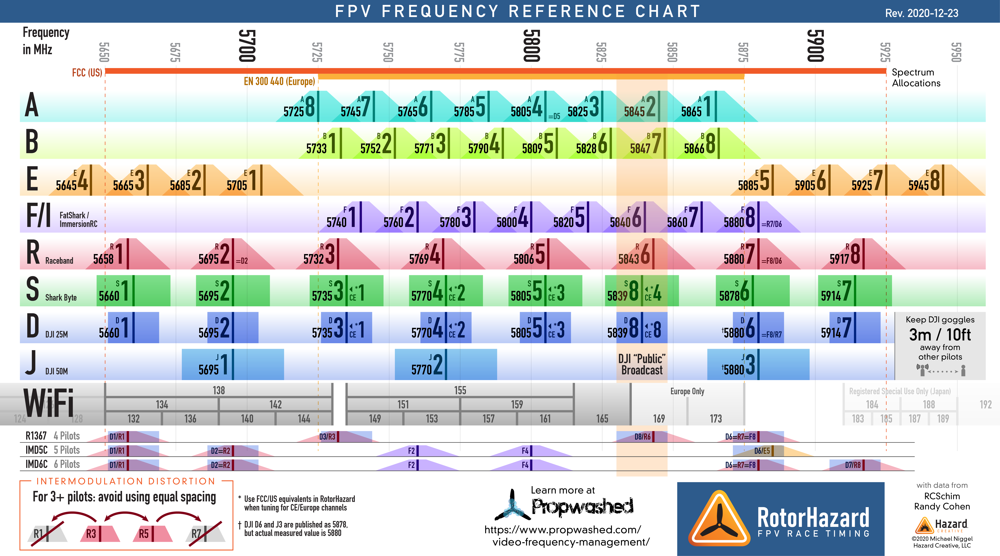

# fpv-channel-finder

Channel calculator for FPV drones to find channels with enough separation.

## How to use

No GUI exists - it's a simple Java app that should be compiled and run. 

In order to change params - modify them in the source code and run.

## Good channel set criteria

There are several reasons not every channel can used when multiple pilots fly simultaneously:

- Channel separation - if two channels are close together then video receiver has hard time distinguishing between 
two signals, especially since no VTX are perfect and they all produce signal spread

- Intermodulation distortion (IMD) - when two VTX work simultaneously on frequencies F1 and F2 there would also be 
2 additional peaks on `F1*2 - F2` and `F2*2 - F1` frequencies

-  Harmonics - 5.8Ghz VTX produce harmonics on F + 190Mhz and F + 240Mhz (can't find reason for this - but they can 
be seen during spectrum scan)

In order to fly comfortable we must choose channels that are far away from all these peaks.

This app simply searches for channel sets that satisfy specified separation parameters.

Note that largest peak is usually from other channels, the IMD peaks are smaller and harmonics are even smaller, this 
should be taken into account when choosing separation gaps (harmonics gap can be set to zero for example if everybody 
has good vtx). Although on some VTX we've seen quite large harmonics peaks - you could almost see another pilot's video 
on a higher channel. 

## Legal and locked channels

In some countries channels E4, E7 and E8 are illegal to use and are locked in some VTX.

In order to use them in Betaflight - you have to mark E band (or any band) as CUSTOM instead of FACTORY. This will make 
FC send command to VTX to set specified frequency (any arbitrary frequency can be set) and not command to set channel 
predefined in VTX.

Some VTX are hardware locked and have to be unlocked to support CUSTOM bands.

## Results

For whoop-style 25mW VTX in confined space separation should be at least:

- 25Mhz between channel and any other channel
- 10Mhz between channel and any harmonic peak 
- 10Mhz between channel and any IMD peak

Sinc IMD and harmonics have far less energy than main channel frequency, so separation gap may be lower for IMD
and harmonics.

But better to have 25/15/15 (channel, harmonic, IMD) separation.

For a top quality VTX and positioning pilots far from the track you can get away with values as low as 25/7/7 - this is 
minimum separation required for the main signal on channel frequency to be stronger than the sum of all noise on this 
frequency.

NOTE! Since F8 and R7 have same frequency - we always use R7 if this frequency match.

NOTE! Although all channels in the set satisfy minimum separation parameters there still are better and worse channels 
in every set - some channels are a bit further from IMD, harmonics and other channels than others. Our tests with 
indoor tinywhoop races show that with 6 pilots at 25/12/18 and 25/10/12 all channels give about the same quality - more 
depends on other pilot's VTX's quality than channel choice from the set.

Note that some whoops have VTX that may drift for several MHz so sometimes it is better to have more separation between
main channel frequencies.

Frequency set found using algorithm by [Sergey Kulakov (@klsrg)](https://github.com/klsrg).

### Best channel sets - no locked channels (E4 E7 E8)

**7 pilots 26/11/11**

`R7 R8 F2 F4 E1 E3 B6`

**6 pilots 37/16/14**

`R1, R2, R4, R8, B6, A1`

`R1, R2, R8, B3, B6, A1`

**6 pilots 35/11/16**

`R1 R2 R4 R8 F7 A3`

**6 pilots 25/17/17**

`R1 R7 R8 F4 B2 A3`

**5 pilots 30/17/26**

`R1 R2 R8 F5 B3`

### Best channel sets - including locked channels (E4 E7 E8)

**7 pilots 26/11/11**

`R7 R8 F2 F4 E1 E3 B6`

**6 pilots 40/16/16**

`R3 R5 E2 E6 E8 B7`

**6 pilots 25/19/19**

`R2 F7 E6 E4 B4 A6`

`R2 E6 E4 B4 A6 A1`

**5 pilots 46/17/27**

`R1 F5 E8 B8 A8`

### Frequency chart 

In case there is some other signal source (for example, wifi) occupying one of the channels used 
in the best sets - consult this chart and try to avoid such channels, although it is likely not possible for 4+ pilots.



### OCTABAND - custom band for 8 pilots

Not supported by VTX/RX at the moment. This band was calculated to give largest possible separation using
legal frequency range 5651Mhz - 5924Mhz.

**8 pilots 26/11/12**

`5658 5684 5738 5765 5805 5832 5886 5912`

Most VTX support setting custom frequency - in Betaflight VTX tab you need to add a band and uncheck Factory checkbox.
When it's set to FACTORY - flight controller send band and channel index to VTX and expects VTX to have preconfigured
list of channels. When set to CUSTOM (checkbox unchecked) flight controller send frequency directly.

NOTE! If band type is set to FACTORY - VTX will still use it's own preconfigured frequency despite of the one entered
in Betaflight!

Some VTXs are hardware/software locked from accepting CUSTOM frequencies, but many can be unlocked using some simple
procedures.

You also need to set this band to receiver in your googles. Not all receivers support custom frequencies:

*ImmersionRC RapidFire* - Favourites band can be set to arbitrary frequencies.

*TBS Fusion* - manual says that custom frequency can be set for any Favourite channel, but under firmware 1.04 the menu
looks different and doesn't have such option (perhaps we were doing something wrong).

Some other receivers can be configured also, but we only list tested ones here.

Closest standard channels:
```
5658 - R1 (5658) +0Mhz
5684 - E2 (5685) -1Mhz
5738 - F1 (5740) -2Mhz
5765 - A6 (5765) +0Mhz
5805 - A4 (5805) +0Mhz
5832 - B6 (5828) +4Mhz
5886 - E5 (5885) +1Mhz
5912 - R8 (5917) -5Mhz
```

Alternatively we can use channel 8 at 5910Mhz to still fulfil separation requirements, but have it closer to standard
channel.

### Lowband

Lowband is frequency set 5.3Ghz-5.7Ghz - completely outside normal FPV VTX range, but some VTX support it so technically
it can be used, but in most countries it is completely illegal and you may cause real problems for devices that used it,
so try this at your own risk or better consult local authorities for temporary usage rights.

At the moment calculator needs about 1-2 hours to get channel set for 10-12 pilots, but it seems that such sets should 
be possible.